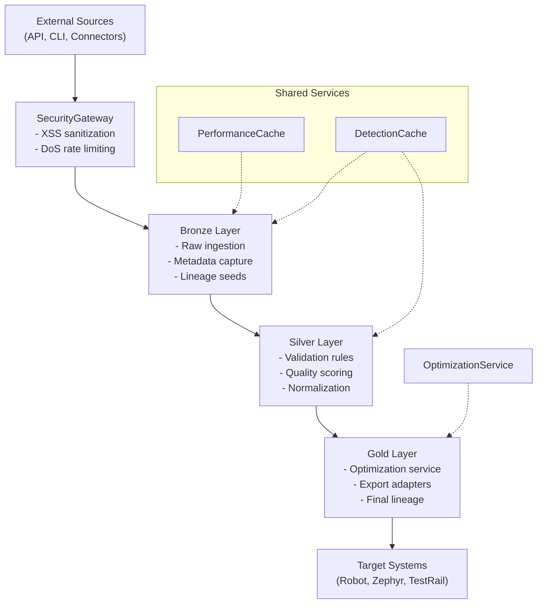

# Medallion Layer Interactions

This diagram illustrates how data flows through Importobot's medallion
architecture and supporting services.

Supporting notes:

- `PerformanceCache` and `DetectionCache` accelerate detection and ingestion
  paths shared by Bronze/Silver layers.
- The optimization service consults Bronze/Silver outputs when simulating
  alternative exports in Gold.
